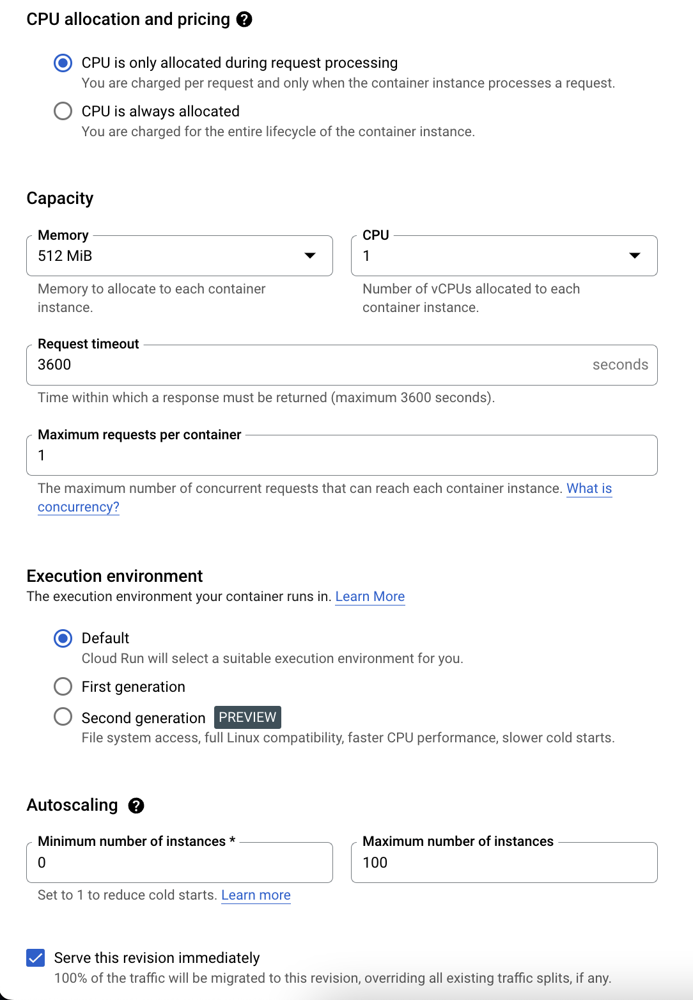
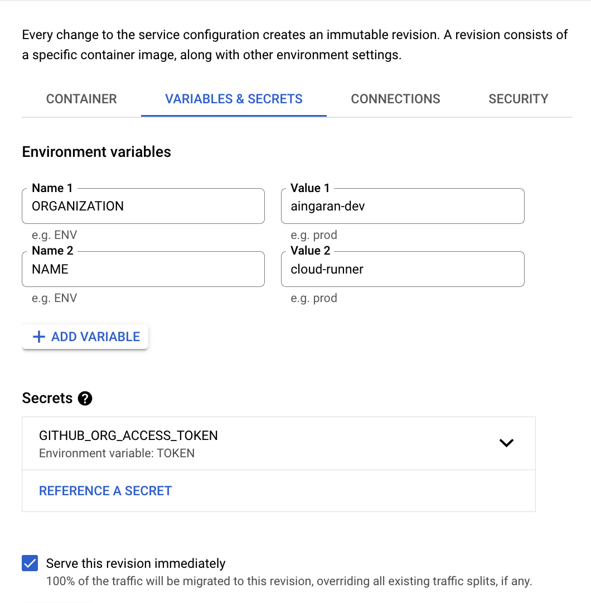

# GitHub self-hosted agent for Cloud Run

A shot at running scalable, cost-efficient GitHub self-hosted runners. 

## What does it do?
This can be deployed as a cloud run service, and when the GitHub workflow is triggered and a webhook call is made by GitHub, a cloud run instance is set up as an agent and awaits the job. 
After the job is completed, the instance is cleaned up and the cloud run service automatically scales down back to 0 (eventually)

## What are the advantages?
- Cloud Run is billed based on the usage. Since this solution can scale down to 0 when not in use, you only have to pay for the CPU and Memory used during the job execution.
- Cloud Run can scale massively. You can run multiple pipelines/jobs simultaneously without having to worry about the agent configuration.
- Cloud Run has access to the service account running the container. It can access any GCP resources securely by granting access with IAM. (Resources within a VPC will require a serverless VPC connector to be setup for accessing them from the cloud run instance)

## Are there any drawbacks?
Yes, ofcourse. Nothing comes without a cost.
- Cloud Run instances have a maximum request timeout of 3600s. Any job running in cloud run agent should complete before that. If not, cloud run will likely terminate the job. Solution is to create smaller independent pipelines that complete before 1 hour.

## Things to note
Since this is not a native solution, there are some things that might cause confusion. Below are the things that might indicate a problem, but doesn't really affect the functionality of the solution.
- GitHub webhook delivery history will show that some webhook calls have timed out. This is because the default timeout for GitHub webhook calls are 10s, and it cannot be modified. But for the cloud run to be active until the job completes, the response for the webhook call should not be sent until the job completes. A cloud run instance is considered to be active only when it is processing a request. If not, the instance is considered idle, and Google can terminate the container to save resources/costs.   

## How to set this up?
- clone/copy/fork this repo and set it up in your Git environment. 
- create a secret in Secret Manager (GCP) to securely store the GitHub Org Access token. This access token should have at least admin:org scope selected.
- create a docker image out of this source code. (you can also configure cloud run to build directly from the source code using cloud build)
- create a cloud run service with the following configuration and the above built image (if you are configuring cloud to build directly from source, make sure you include the following configuration as well)         
  - under container tab, set request time out to the maximum value
  - under container tab, set maximum request per container as 1 (GitHub runners can run only one job per agent)
  - under container tab, set the minimum autoscaling to 0 and maximum as per the number of maximum agents you would require (max. number of jobs you may run parallely).
  - under variables & secrets tab, create environment variables for "ORGANIZATION" (name of the GitHub Organization) and "NAME" (name prefix for the runners)
  - under variables & secrets tab, reference the previously created GITHUB_ORG_ACCESS_TOKEN as an environment variable named "TOKEN"
  - (Optional) under variables & secrets tab, create environment variable "LOG_LEVEL" to override the level of logging set in the logger.cfg. Acceptable values are ['NOTSET', 'DEBUG', 'INFO', 'WARN', 'ERROR', 'CRITICAL']
- add a webhook under in your GitHub organization's settings with the payload url as the cloud run service url, content type as "application/json" and "Workflow jobs" selected as events to trigger the webhook.
- use `runs-on: self-hosted` in your workflow files to use the agent we just created for running the workflows.

### Misc
`test-registration.sh` contains scripts that can set up an agent for testing. To use it, you need to download the agent binaries and set the variables "TOKEN", "ORGANIZATION" and "NAME". Do not run this unless you know what you are doing. 